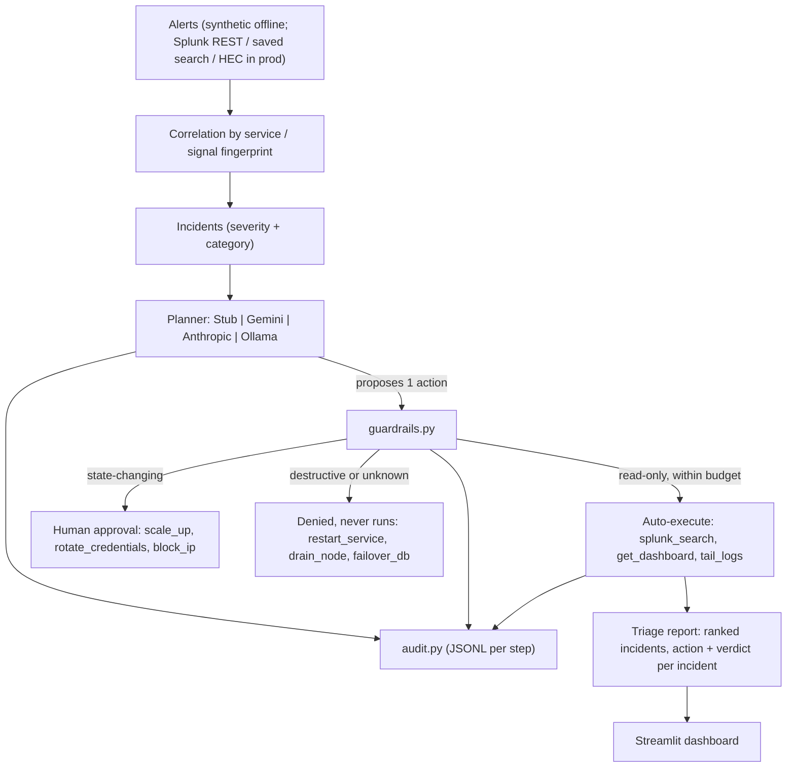

# alertward architecture

A guarded, audited incident-triage agent for agentic ops. The planner proposes one remediation per incident; a code-enforced guard decides whether it runs; every step is logged.

## Flow

## Guard (code, not prompt)

`guardrails.py` sits between the planner and execution. An action's risk class is intrinsic to the action type (`actions.py`), not asserted by the planner, and unknown ops default to **destructive**. Three checks run in order:

1. **Target scope** - an allowlist of services the agent may touch.
2. **Risk class** - read-only auto-executes; state-changing requires human approval; destructive is denied.
3. **Auto-execution budget** - a per-run cap on how many actions auto-execute.

Deny reasons are a closed `Literal` union, so a typo can never silently flip a decision.

## Components

| Module | Responsibility |
|---|---|
| ingestion | Reads alerts (synthetic stream offline; Splunk REST / saved search / HEC in prod). |
| correlation | Groups alerts sharing a service or signal fingerprint into incidents. |
| classification | Assigns severity and category (availability, latency, security, capacity, data quality). |
| `actions.py` | Defines each op and its intrinsic risk class. |
| planner (`Backend`) | Runtime-checkable protocol with `propose()`; Stub (keyless, deterministic) plus optional Gemini / Anthropic / Ollama (lazy-imported). |
| `guardrails.py` | Target scope, risk class, auto-execution budget. |
| `audit.py` | One flushed JSONL record per step (run_start, incident, proposal, decision, execution, report, run_end). |
| reporting | Triage report + Streamlit dashboard. |

The whole loop runs offline with no API key and no Splunk instance, so a judge can verify it in one command.
